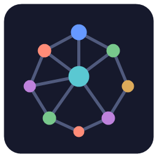

<p align="center"></p>

# NeuroMesh

A fully offline, native Rust desktop application that ingests notes (txt, md — pdf, docx,
LaTeX planned), auto-categorizes them with rule-based NLP, and visualizes them as an
interactive knowledge graph.

## Download & install (Windows)

Grab the latest `NeuroMesh-Setup-x.y.z.exe` from
[**Releases**](https://github.com/SC0R9I0N/neuromesh/releases) and run it. No admin
rights needed — it installs per-user by default and offers a desktop shortcut (checked
by default). A standalone `neuromesh-portable.exe` is also attached to each release if
you prefer no installer.

Your notes database lives in `%APPDATA%\NeuroMesh\neuromesh.db` — fully local, nothing
leaves your machine. Uninstall via Windows Settings → Apps (the database is kept).

## Build from source

```sh
cargo run --release
```

Requires a Rust toolchain (stable). SQLite is bundled — no system dependencies.

## Releasing

Push a version tag and GitHub Actions builds the installer and publishes the release:

```sh
git tag v0.1.0
git push origin v0.1.0
```

The workflow (`.github/workflows/release.yml`) builds the release binary on
`windows-latest`, compiles `installer/neuromesh.iss` with Inno Setup (preinstalled on
the runner), and attaches the setup exe + portable exe to a GitHub Release.

## Usage

- **Import notes…** (top bar or left panel) opens a native file picker. `.txt` and `.md`
  files are parsed into sections, categorized, and added to the graph.
- **Graph canvas**: drag empty space to pan, scroll to zoom, drag a node to reposition it,
  click a node to open the detail panel.
- **Node panel** (right): edit title, tags, and content; follow connections to neighbors.
- Layout runs a force-directed simulation (Fruchterman–Reingold variant) and persists
  final positions to SQLite.

## Architecture

See `CLAUDE.md` for the authoritative blueprint. Module map:

```
src/
  ui/        egui panels: graph canvas, node detail, file browser
  graph/     in-memory graph, force-directed layout, painter-based renderer
  storage/   SQLite persistence (rusqlite) + data models
  ingest/    per-format parsers (txt/md real; pdf/docx/latex stubs)
  nlp/       rule-based categorization: keywords, tag rules, document structure
  app.rs     application state + workflow orchestration
  main.rs    eframe entry point
```
